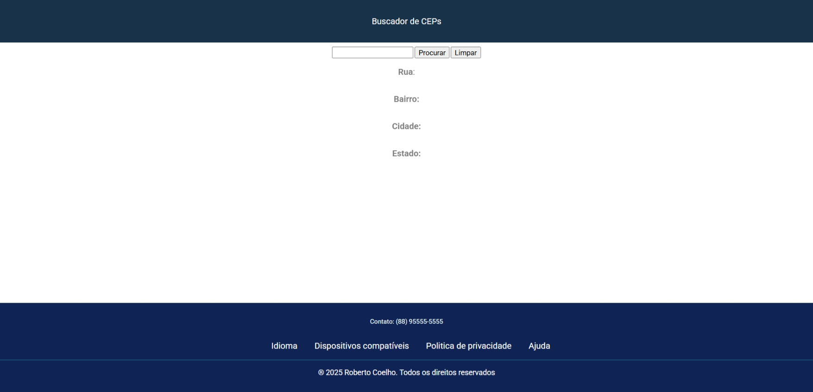

# Projeto buscador de Ceps

O objetivo do projeto é pesquisar CEPs em uma api chamada https://viacep.com.br.

## Design do projeto



## API utilizada

A api https://viacep.com.br retorna um json contendo as seguintes informações para um cep de exemplo 61652062:

```
// https://viacep.com.br/ws/61652062/json/

{
  "cep": "61652-062",
  "logradouro": "Rua 3",
  "complemento": "(Lot Esplanada Araturi)",
  "unidade": "",
  "bairro": "Araturi (Jurema)",
  "localidade": "Caucaia",
  "uf": "CE",
  "estado": "Ceará",
  "regiao": "Nordeste",
  "ibge": "2303709",
  "gia": "",
  "ddd": "85",
  "siafi": "1373"
}
```

## Funcionalidades

- [x] Busca do CEP
- [x] Limpar dados
- [ ] Melhorado o design
- [ ] Responsividade
- [ ] Rodapé

### Observações

> [!NOTE]
> Projeto feito na disciplina de programação web I do curso ADS do ifce de jaguaruana.

> [!IMPORTANT]
> Alguns CEPs podem não conter todas as informações.

## Contatos

Email: rocha.coelho60@aluno.ifce.edu.br
